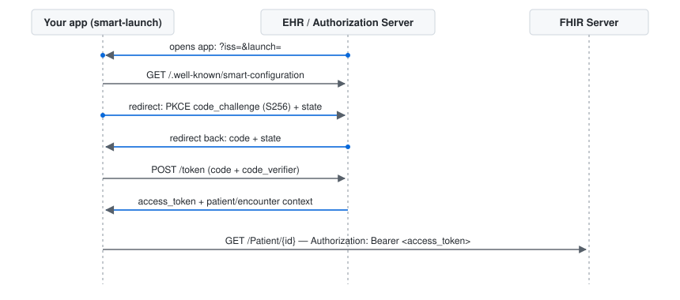

# smart-launch

> **Production-ready SMART on FHIR authentication for Node.js healthcare
> applications.**

**Category:** FHIR & SMART — Interoperability Libraries · **License:** Apache-2.0 · **Status:** alpha

---

## 1. Overview

- ✅ SMART App Launch (v1 and v2 scope syntax)
- ✅ EHR Launch
- ✅ Standalone Launch
- ✅ PKCE (S256)
- ✅ FHIR Discovery (`.well-known/smart-configuration` + CapabilityStatement fallback)
- ✅ Token Management (exchange, refresh-before-expiry, typed errors)
- ✅ Framework Agnostic (zero Express/React dependency in core)

Every SMART on FHIR integration re-implements the same brittle first step:
the OAuth2 Authorization Code Grant with PKCE, EHR-launch vs.
standalone-launch handling, token exchange, and refresh. Vendor sandboxes
(Epic, Cerner/Oracle Health, SMART Health IT) each have small quirks in
this flow, and getting it wrong is the single most common cause of failed
FHIR integrations. `smart-launch` implements this once, correctly, against
the SMART App Launch specification — fully typed, with a pluggable token
storage interface so you bring your own production backend instead of
inheriting an opinionated one.

## 2. Why smart-launch?

- **Framework agnostic** — the core (`src/`) has zero dependency on
  Express, React, or any HTTP framework; `express` is a devDependency used
  only by the example apps, not shipped in the published package.
- **Supports both SMART launch types** — EHR launch and standalone launch
  share the same discovery/PKCE/token machinery, each with its own
  redirect-building and callback-handling functions.
- **Production-oriented, not a toy demo** — a typed `TokenStorage`
  interface (not an opinionated database), a typed error hierarchy for
  every real OAuth2/SMART failure mode, and a dedicated
  [Production Guide](./docs/PRODUCTION_GUIDE.md) covering session handling,
  refresh strategy, and a pre-launch security checklist.
- **Clean, small architecture** — seven focused modules
  (`discovery`, `pkce`, `launch/ehr`, `launch/standalone`, `token`,
  `context`, `storage`), each independently unit-tested; no framework
  magic to reverse-engineer.
- **Vendor-neutral implementation, vendor-aware documentation** — the
  library itself makes no vendor-specific assumptions (FR5: everything is
  caller-supplied config), while [vendor-notes.md](./docs/vendor-notes.md)
  and [common-errors.md](./docs/common-errors.md) document the real,
  vendor-specific quirks encountered validating this against Epic, Cerner,
  and SMART Health IT live.
- **Documented from real failures, not just the happy path** — every
  troubleshooting note in this repo traces back to an actual error
  reproduced and diagnosed during development, not a hypothetical.

## 3. Architecture

**Core library is framework-agnostic** (plain TypeScript, no Express/React
dependency) so it embeds in any Node backend or edge runtime. The example
apps under `docs/examples` add a thin Express adapter on top.

<figure>
  
  <figcaption>Request flow for an EHR launch. Standalone launch is the same sequence minus the EHR's initial <code>iss</code>/<code>launch</code> parameters.</figcaption>
</figure>

### Module layout

| Module | Responsibility |
|---|---|
| `discovery` | Resolves authorization/token endpoints from `.well-known/smart-configuration`, with a CapabilityStatement fallback |
| `pkce` | `code_verifier`/`code_challenge` generation (S256) and `state`/`nonce` generation |
| `launch/ehr` | EHR launch parameter handling and redirect construction |
| `launch/standalone` | Standalone launch redirect construction |
| `token` | Code-for-token exchange, refresh, expiry tracking |
| `context` | Typed parsing of launch-context claims from the token response |
| `storage` | `TokenStorage` interface + an in-memory reference implementation only |

### EHR launch sequence

1. EHR opens the app with `?iss={fhirBaseUrl}&launch={launchId}`
2. App fetches `{iss}/.well-known/smart-configuration` to discover the
   authorize/token endpoints (`discover`)
3. App generates a PKCE verifier/challenge and a random `state`, persists
   them for the callback, and redirects the browser to the authorize
   endpoint with `launch`, `aud`, `code_challenge`, and scopes
   (`buildEhrAuthorizationRequest`)
4. The EHR authenticates the user (outside this library's scope) and
   redirects back to `redirect_uri` with an authorization code and `state`
5. App validates `state`, then exchanges the code + `code_verifier` for a
   token (`handleEhrCallback`)
6. The token endpoint returns `access_token`, `refresh_token` (if
   `offline_access` was granted), `id_token`, and launch context claims
   (e.g. `patient`)
7. App stores the token via the configured `TokenStorage` implementation

Standalone launch follows the same steps minus step 1's `launch`
parameter and any launch-context claims in step 6. This is a summary for
orientation — refer to the current
[SMART App Launch Implementation Guide](https://hl7.org/fhir/smart-app-launch/)
for the canonical, authoritative sequence.

## 4. Features

### Capability matrix

| Capability | Status |
|---|---|
| SMART App Launch | ✅ |
| EHR Launch | ✅ |
| Standalone Launch | ✅ |
| PKCE (S256) | ✅ |
| OAuth2 | ✅ |
| Discovery Endpoint | ✅ |
| Token Refresh | ✅ |
| Launch Context | ✅ |
| Framework Agnostic | ✅ |

### Compatibility matrix

| Platform | Status |
|---|---|
| SMART App Launch 2.x scopes | ✅ verified live against Epic (v2 fine-grained scopes) |
| FHIR R4 | ✅ every example/vendor test in this repo targets R4 |
| FHIR R4B | Planned — not yet tested |
| FHIR R5 | Planned — not yet tested |
| Node.js 18+ | ✅ per `package.json` engines; developed and tested on Node 20 |
| TypeScript | ✅ strict mode, full type declarations published |

Full feature detail:

- EHR launch flow: `iss`/`launch` parameter handling, endpoint discovery,
  authorization redirect, and callback validation
- Standalone launch flow: same discovery/PKCE/token path for apps that
  already know their FHIR server
- Authorization Code Grant with PKCE (S256 only — no `plain` method)
- Discovery via `.well-known/smart-configuration`, with a CapabilityStatement
  (`oauth-uris` extension) fallback
- Token exchange, automatic refresh-before-expiry, and typed OAuth2 error
  surfacing (`invalid_grant`, state mismatch, PKCE failure, etc.)
- Typed parsing of launch-context claims (`patient`, `encounter`, `fhirUser`,
  `need_patient_banner`, `smart_style_url`) that tolerates any of them
  being absent
- Pluggable `TokenStorage` interface with an in-memory reference
  implementation (not for production use)
- Zero hardcoded client IDs, secrets, or scopes — everything is
  config-driven

## 5. Installation

```bash
npm install smart-launch
```

## 6. Quick Start

This example runs the standalone launch flow against the public
[SMART Health IT sandbox](https://launch.smarthealthit.org/) — no
registration required.

```ts
import {
  buildStandaloneAuthorizationRequest,
  handleStandaloneCallback,
  type LaunchConfig,
} from "smart-launch";

const config: LaunchConfig = {
  clientId: "YOUR_CLIENT_ID_HERE", // the sandbox accepts any client_id for its public test apps
  scopes: ["openid", "fhirUser", "patient/*.read"],
  redirectUri: "http://localhost:3001/callback",
  iss: "https://launch.smarthealthit.org/v/r4/fhir",
};

// 1. Build the redirect (send the browser to `authorizationUrl`,
//    and persist `pending` — session, signed cookie, etc.).
const { authorizationUrl, pending } = await buildStandaloneAuthorizationRequest(config);

// 2. On the callback route, validate `state` and exchange the code:
// const token = await handleStandaloneCallback(req.query, pending, config);
// token.accessToken, token.context.fhirUser, ...
```

See it running end-to-end with a real Express server in
[docs/examples/standalone-launch](./docs/examples/standalone-launch) and
[docs/examples/express-ehr-launch](./docs/examples/express-ehr-launch):

```bash
git clone https://github.com/PeerbitsSolution/smart-launch.git
cd smart-launch
npm install
npm run example:standalone
# open http://localhost:3001
```

## 7. Examples

Both launch types are demonstrated as complete, runnable Express apps —
see [docs/examples](./docs/examples):

- [`docs/examples/express-ehr-launch`](./docs/examples/express-ehr-launch) —
  EHR launch, meant to be opened *from* an EHR (or the SMART Health IT
  sandbox launcher)
- [`docs/examples/standalone-launch`](./docs/examples/standalone-launch) —
  standalone launch, initiated by the app itself against a known FHIR server

Each example's README has copy-paste run instructions. Both are
configured entirely via environment variables — nothing is hardcoded
beyond obvious placeholders:

| Env var | Used by | Default | Purpose |
|---|---|---|---|
| `PORT` | both | `3000` (EHR) / `3001` (standalone) | Port the example app listens on |
| `SMART_CLIENT_ID` | both | `YOUR_CLIENT_ID_HERE` | Client ID registered with the vendor or sandbox |
| `SMART_REDIRECT_URI` | both | `http://localhost:<port>/callback` | Must exactly match what's registered with the vendor — verified strictly by every vendor tested |
| `SMART_FHIR_ISS` | standalone only | `https://launch.smarthealthit.org/v/r4/fhir` | FHIR server base URL. The EHR example instead gets `iss` at runtime from the `?iss=` launch parameter, so it has no equivalent variable |
| `SMART_SCOPES` | both | v1-style wildcard (e.g. `openid fhirUser patient/*.read`) | Space-separated scope list — **version-sensitive**; see [common-errors.md](./docs/common-errors.md#invalid-scope) |

## 8. Documentation

Beyond this README:

- **[Production Guide](./docs/PRODUCTION_GUIDE.md)** — replacing
  `InMemoryTokenStorage`, where `PendingLaunch` should live between
  redirect and callback, a full error-class reference, refresh-token
  strategy, a pre-launch security checklist, and sandbox-vs-production
  config patterns.
- **[Vendor Notes](./docs/vendor-notes.md)** — per-vendor supported
  launch types, required scopes, known limitations, and common
  implementation issues for SMART Health IT, Epic, Cerner (hands-on
  tested) plus athenahealth, eClinicalWorks, Canvas Medical, and Medplum
  (from public docs).
- **[Common Errors](./docs/common-errors.md)** — causes and fixes for
  `redirect_uri` mismatch, `invalid_grant`, PKCE failures, missing launch
  parameters, invalid scope, issuer mismatch, and missing patient context.

### Project structure

```text
src/
 ├── discovery.ts       # .well-known/smart-configuration + CapabilityStatement fallback
 ├── pkce.ts             # code_verifier/code_challenge (S256), state/nonce
 ├── launch/
 │    ├── ehr.ts         # EHR launch redirect + callback
 │    └── standalone.ts  # standalone launch redirect + callback
 ├── token.ts            # exchange, refresh, expiry tracking
 ├── context.ts          # launch-context claim parsing
 ├── storage.ts          # TokenStorage interface + in-memory reference
 ├── types.ts
 ├── errors.ts
 └── index.ts            # public API surface

docs/
 ├── PRODUCTION_GUIDE.md
 ├── vendor-notes.md
 ├── common-errors.md
 ├── assets/             # architecture diagram
 └── examples/           # runnable EHR-launch and standalone-launch apps

tests/                   # mirrors src/ 1:1, plus tests/examples/
```

## 9. Roadmap

- [ ] SMART Backend Services support (system-to-system, no user context) —
      explicitly out of scope for this repo; candidate for a future
      package in this initiative
- [ ] Additional `TokenStorage` reference adapters (Redis, encrypted
      cookie) as documented examples — core package stays backend-agnostic
- [ ] Expanded launch-context claim coverage as the SMART spec adds new
      standard claims
- [ ] FHIR R4B / R5 validation (currently R4-only, hands-on tested)

## 10. Contributing

See [CONTRIBUTING.md](./CONTRIBUTING.md). Issues tagged `good first issue`
are a good place to start.

## 11. License

Apache License 2.0 — see [LICENSE](./LICENSE).

## 12. About PeerbitsSolution

PeerbitsSolution builds production-grade healthcare software and
publishes reusable open-source components for modern HealthTech
platforms. `smart-launch` is part of that initiative — reusable
engineering extracted from real healthcare technology work, published so
other teams don't have to solve the same problem from scratch. This
repository contains generalized, reusable logic only; it is not tied to
any specific client engagement or commercial product.

[github.com/PeerbitsSolution](https://github.com/PeerbitsSolution)
